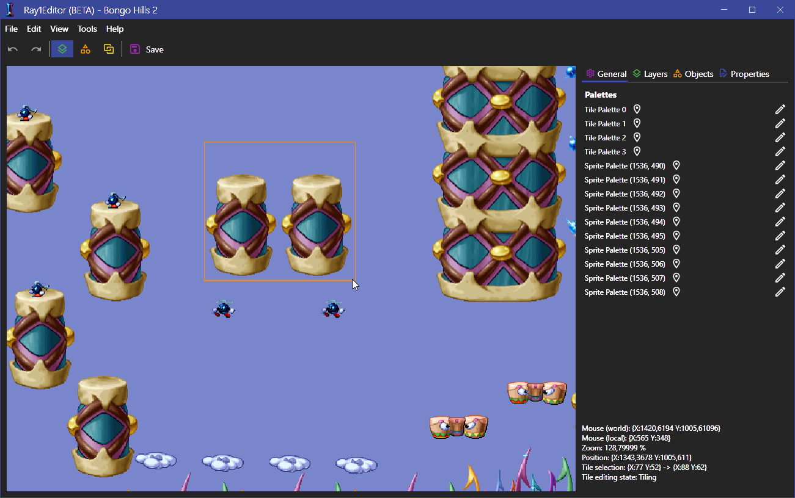
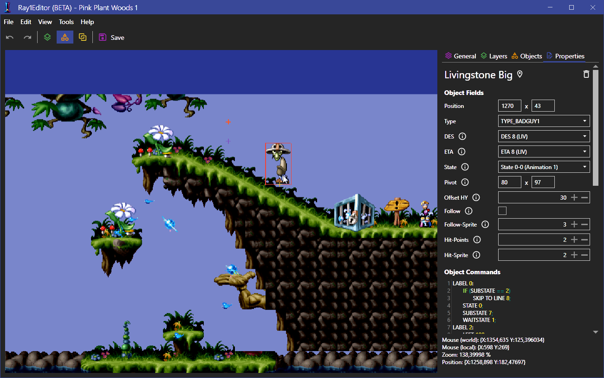
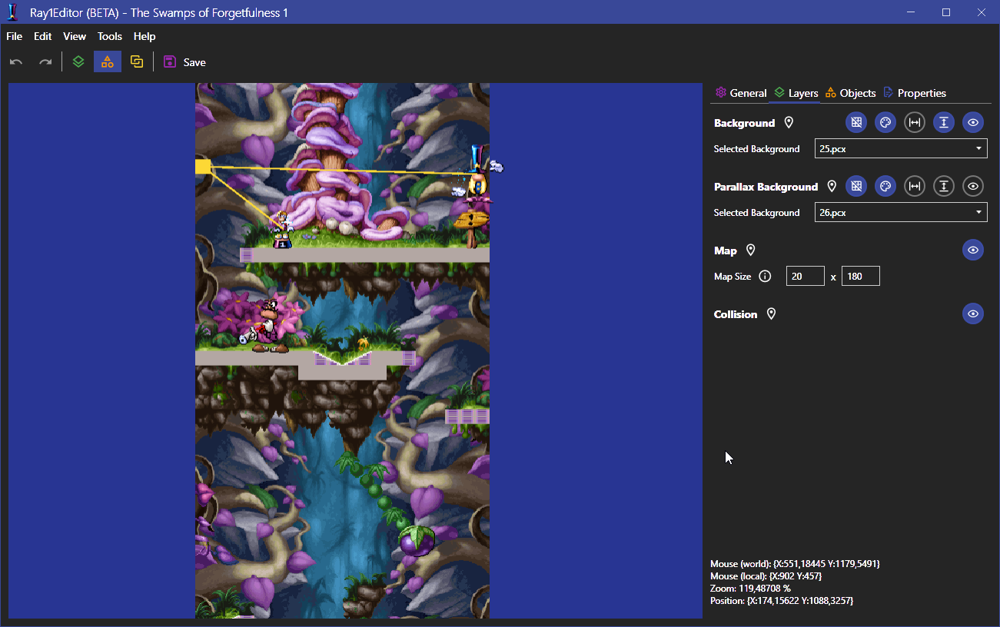

# Ray1Editor - 2D map editor
The Ray1Editor is a 2D game editor used to modify maps in games. It is derived from the [Ray1Map](https://github.com/Adsolution/Ray1Map) project.

## Supported games
* Rayman 1 PS1 (US)
* Rayman 1 PC (1.00, 1.10, 1.12, 1.20, 1.21, 1.21 JP, Demo 1, Demo 2)
* Rayman Educational PC (EDU/QUI)
* Rayman Designer PC (KIT, KIT demo)
* Rayman by his Fans PC
* Rayman 60 Levels PC

## Getting started
* Download the latest release.
* Open the program and add a new game. Set the path to the game installation and specify the mode and name.
* Select the game in the list and choose a map to load.
* Modify the map using the 3 available edit modes (tiles, objects and links) and the available options in the panel to the right. For more help with the editor, check the help menu.
* When finished editing, save your changes and test them in-game. It is always recommended to keep a backup of the game files before saving.

### Saving Rayman 1 (PS1)
The PS1 version of Rayman 1 is more complicated to save than the PC version. For this you will need the following:
* The path specified when adding the game must contain every file on the disc. This includes the .str and .raw files (which can't be copied normally). If not all files are included then the repacked ISO either won't work or the sounds won't play.
* The game folder must contain a disc.xml, containing a list of the files and the license to use when repacking the ISO.
* The path to the mkpsxiso program must be specified in the app settings as that is required when repacking the ISO.

## Screenshots

## FAQ
**Q: Why is the exe so big?**

A: Due to it running in .NET Core rather than .NET Framework it means that compiling it as a single exe will include the entire runtime in it.

**Q: Will the editor support all games which Ray1Map supports?**

A: No, but it's planned to add support for more games and versions. Feel free to leave suggestions for games you want added. If you want to add your own games (non-Rayman included), feel free to talk to me about it and/or make a pull request.

**Q: My edited level crashes when I try and open it again, can it be fixed?**

A: It depends on how the level data is corrupted. Feel free to send me the modified level file and/or the serialization log and I can try repairing it.

**Q: Can I import custom tiles/backgrounds/sprites etc.?**

A: Not currently, but it's a planned feature. In the meantime if you want it for a mod you can send me the modified data and I can manually import it into the game files.

**Q: Which libraries were used for this?**

A: Primarily [BinarySerializer.Ray1](https://github.com/RayCarrot/BinarySerializer.Ray) for parsing Rayman 1 data, [MahApps.Metro](https://github.com/MahApps/MahApps.Metro) for the XAML styles, [MonoGame WPF Interop](https://github.com/MarcStan/monogame-framework-wpfinterop) for using MonoGame in WPF and [NLog](https://github.com/NLog/NLog) for logging.

## TODO
In the code there are several comments for changes which should be made. These are marked with either 'TODO' or 'IDEA'. The former are for more improtant changes while the latter is for optional improvements. Other potential changes not mentioned in comments include:
* Undo/redo for editing. This is currently shown in the UI, but disabled.
* Allow Rayman 1 commands to be modified.
* Allow sprites, animations and states to be viewed and modified. These options are shown in the menu, but disabled.
* Allow real-time editing while running the game. This is already partially supported in Ray1Map.
* Automatically add/remove always objects when adding/removing objects in Rayman 1.
* Use object type flags in Rayman 1 to determine object attributes, such as if they can be linked (PC only) or if they are always objects.
* Handle multi-colored and frame variant objects better in event sheet for Rayman 1.
* Parse the ETA structs better in the PS1 version of Rayman 1, avoiding reading the wrong amount and thus repacking the wrong amount when saving.
* Allow tiles to be selected like objects, allowing tile attributes to be modified (such as the transparency for Rayman 1 on PC or the palette index for Rayman 1 on PS1).

## Licence

[MIT License (MIT)](./LICENSE)